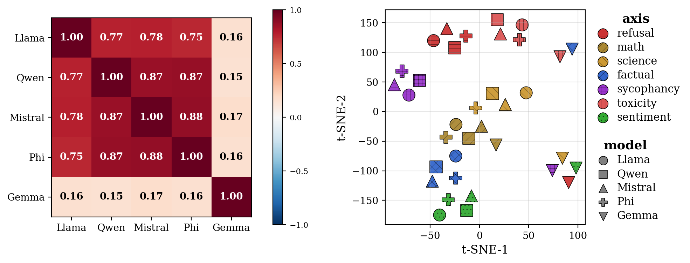
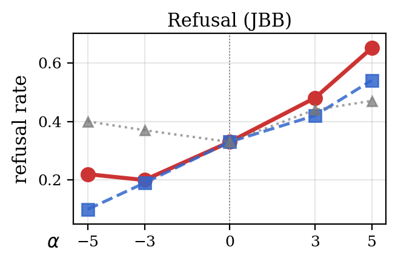
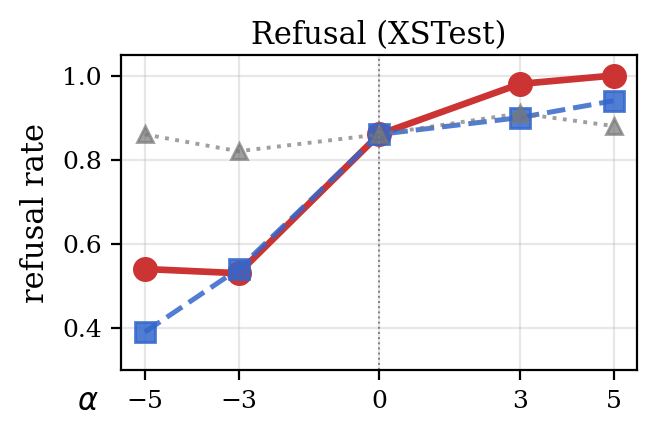
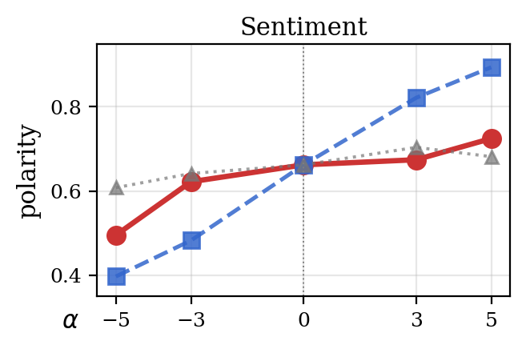

<div align="center">

# Cross-Family Universality of Behavioral Axes via Anchor-Projected Representations

We introduce a shared coordinate system in which behavioral directions extracted from one
set of LLMs transfer to a previously unseen model — **without target-specific
fine-tuning, axis-labeled data, or a learned mapping.**

[](LICENSE)
[](#)



*Behavioral directions from 5 instruction-tuned LLM families projected
into a shared 300-dim Anchor Coordinate Space (ACS). Same-axis directions
form tight clusters across Llama, Qwen, Mistral, and Phi; Gemma sits at the
periphery.*

</div>

---

## Highlights

- **Build a shared coordinate space across unrelated LLM families.**  
  We map hidden states from Llama, Qwen, Mistral, Phi, and Gemma into the same 300-dimensional Anchor Coordinate Space (ACS), even though the models have different hidden sizes, tokenizers, and training recipes.

- **Transfer behavioral directions without target-model labels.**  
  A direction learned from source models—such as refusal, sentiment, math, or bias—can be projected into ACS and reconstructed in a new model using only that model’s anchor activations. No retraining are required.


## Why it matters

When a new LLM is released, today's typical interpretability workflow is:

1. Collect axis-labeled positive / negative examples on the new model.
2. Extract a per-model native direction via mean-difference.
3. Use that direction for probing or activation steering.

This procedure has to be repeated for every model in every release, and the
resulting directions live in incompatible hidden bases. **ACS replaces this
with a one-time forward pass on a fixed pool of 300 anchor prompts.** No
axis labels are required on the new model, and the recipe applies uniformly
across families.


## How it works (3 steps)

```text
1. Anchor Projection  (per model, no training)
   A_m  = forward(model_m, anchor_pool)
   pi_m = RowNormalize(A_m - mean(A_m))

2. Native -> Canonical  (in ACS, R^N = 300)
   v_a^(m) = mean(pos_a) - mean(neg_a)        # native direction
   u_a^(m) = pi_m · v_a^(m)                   # projected into ACS
   c_a     = average_m u_a^(m)                # canonical direction

3. Reconstruct  (target model, anchors only)
   v_a^(mu, recon) = pi_mu^T · c_a
```


**Step 1 — Anchor Projection.**  
Forward the same anchor prompts through each model to build a model-specific projector into the shared Anchor Coordinate Space (ACS).

**Step 2 — Native → Canonical.**  
Extract behavioral directions in source models, project them into ACS, and average them as one canonical direction per axis.

**Step 3 — Reconstruction.**  
Map the canonical ACS direction back into the unseen model’s native hidden space using only its anchor activations, then use it for detection or residual-stream steering.


## Cross-family Detection Result (Section 6)


We evaluate whether ACS can recognize behavioral axes on a **held-out target model**, using probes trained only on the remaining source models.

- **Multi-CLS** asks: *Which behavioral axis does this prompt belong to?*  
  For example: refusal, math, factuality, sentiment, toxicity, bias, etc.

- **Binary-CLS** asks: *Is this prompt on the positive or negative side of a given axis?*  
  For example: harmful vs. benign for refusal, positive vs. negative for sentiment.


| | LQMP (4-fam) | LQMPG (5-fam) |
|---|:---:|:---:|
| 10-way Multi-CLS accuracy | **0.83 ± 0.02** | 0.70 ± 0.27 |
| mean Binary-CLS AUROC | **0.95 ± 0.01** | 0.90 ± 0.09 |

**Takeaway.**  
ACS lets us detect what kind of behavioral signal a prompt activates in an unseen model, without extracting new axis directions from that model. The LQMP cluster transfers strongly; Gemma is included as a harder outlier case.

## Behavioral Steering Result (Section 7)

We test whether the same canonical ACS directions can be turned back into steering vectors for an unseen model.

The pipeline is simple:

1. Build a canonical direction in ACS from source models.
2. Reconstruct it into the unseen model’s native hidden space.
3. Inject the reconstructed vector into the residual stream during generation.

<table>
<tr>
<td></td>
<td></td>
</tr>
<tr>
<td colspan="2"></td>
</tr>
</table>

| Axis | In-distribution Δ | OOD Δ |
|---|:---:|:---:|
| refusal | +0.22 | +0.43 (JBB), +0.46 (XSTest) |
| sentiment | +0.23 | — |


In the plots, the **red solid line** is our ACS-reconstructed canonical direction, while the **blue dashed line** is the native direction extracted directly from the target model. This shows that source-averaged ACS directions can sometimes generalize better than target-native vectors under distribution shift.

---

## Repository layout

```
ACS/
├── README.md                 
├── LICENSE                   
├── requirements.txt
├── configs/models.yaml       ← HF IDs · d_m · n_layers · best_layer per model
├── data/                     ← all small-text prompts (no model weights, no acts)
│   ├── README.md
│   ├── anchors.jsonl                     (300 HELM prompts)
│   └── axes/                             (10 axes × {anchor, test} + 3 refusal OOD)
├── acs/                      
│   ├── projector.py          
│   ├── canonical.py          
│   ├── activations.py        
│   ├── datasets.py           
│   ├── scorers.py            
│   └── config.py             
├── scripts/                  ← reproducibility scripts (run in order)
│   ├── 01_extract_activations.py    ← Step 1
│   ├── 02_universal_similarity.py   ← Section 5
│   ├── 03_detection.py              ← Section 6
│   └── 04_steering.py               ← Section 7
└── figures/                  
```

---

## Quickstart

```bash
# 1. Install
pip install -r requirements.txt

# 2. (Optional) Override defaults in configs/models.yaml — e.g. swap GPUs or
#    add a new model family.

# 3. Forward 300 anchors + 10 axis sets through the 5 main models (~10 min/model).
python scripts/01_extract_activations.py --device cuda:0

# 4. Universal-space similarity figure (Section 5, < 1 min CPU)
python scripts/02_universal_similarity.py
#   -> outputs/universal/fig_universal.{png,pdf}, cossim_{5x5,per_axis}.json

# 5. 5-rotation detection (Section 6, ~2 min total)
python scripts/03_detection.py --ood
#   -> outputs/detection/{per_axis_per_unseen,5rotation_aggregate,refusal_ood}.json

# 6. Behavioral steering on Mistral (Section 7, ~30 min per axis on 1 GPU)
python scripts/04_steering.py --axis refusal             # in-dist (WildJailbreak)
python scripts/04_steering.py --axis refusal --ood jbb   # JailbreakBench OOD
python scripts/04_steering.py --axis sentiment
#   -> outputs/steering/{unseen}_{axis}[_ood_{split}].json
#
# Note: the script ships scorers for the two axes above; paper Section 7
# additionally evaluates emotion, math, and bias_{gender,race}. Implementing
# those follows the same pipeline (canonical -> reconstruct -> α-sweep) with
# axis-specific evaluation (see paper Appendix A.5 for the exact scorers).
```

Every script supports `--help` for the full list of flags (axis subset,
model subset, OOD split, α-sweep, etc.).

### Reproducing sensitivity figures

```bash
python scripts/sensitivity/anchor_count.py     # Figure 4 left
python scripts/sensitivity/source_count.py     # Figure 4 right
python scripts/sensitivity/scale_sweep.py      # Figure 5 right
```

Per-model layer indices `L_m` are pre-defined in `configs/models.yaml`
(`best_layer`). They follow the cross-family axis-mean cosine-similarity
metric described in paper Section 4.2 and were fixed once before all
downstream experiments; treat them as hyperparameters rather than something
to re-tune in this repository.

The scale sweep requires activations from the 6 additional variants listed
under `models_scale` in `configs/models.yaml`:

```bash
python scripts/01_extract_activations.py --pool scale
python scripts/sensitivity/scale_sweep.py
```

---

---

## Configuration

Everything model-specific lives in `configs/models.yaml`:

```yaml
models_main:
  llama8b:
    hf_id: meta-llama/Llama-3.1-8B-Instruct
    d_model: 4096
    n_layers: 32
    best_layer: 12          # 3/8  ← selected via the BEST_LAYER metric
    dtype: bfloat16
  # ... 4 more families
```

`best_layer` is selected per model by the cross-family axis-mean intra-axis
cosine similarity metric in ACS (paper Section 4.2 and the appendix
"BEST_LAYER selection metric" subsection). The release ships these values
pre-defined; treat them as fixed hyperparameters.

## Citation

```bibtex
@inproceedings{anonymous2026acs,
  title     = {Cross-Family Universality of Behavioral Axes via
               Anchor-Projected Representations},
  author    = {Anonymous},
  year      = {2026},
}
```

## License

MIT, see [LICENSE](LICENSE).
